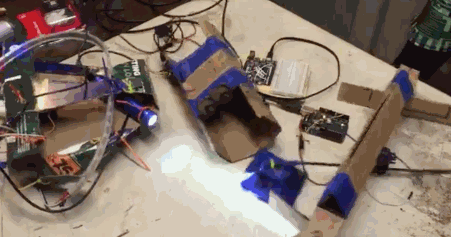
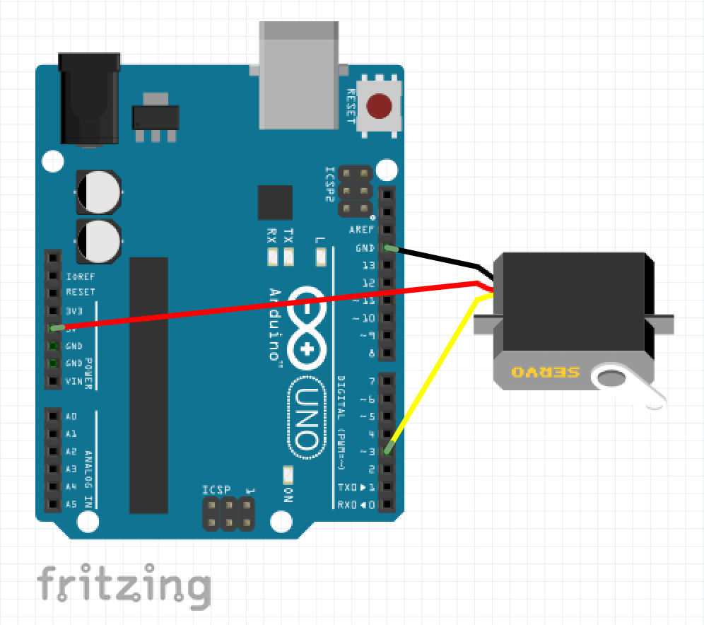

# Terrible Cardboard Nodebots

Robots!  Made of cardboard!  Programmed with node.js! 

How'd they turn out?  Pretty terrible.

Featured in this [Daily Dot article](http://www.dailydot.com/technology/dadaconf-nimby-robots/)

## Build your own

### Gather these things

- Cardboard
- Zip ties
- Tape or something 
- An [Arduino Uno](http://www.amazon.com/ARDUINO-A000066-Uno-DIP-1-5/dp/B00CBZ4CII/ref=sr_1_7?ie=UTF8&qid=1464071011&sr=8-7&keywords=arduino+uno)
- A servo or something (here's [one](http://www.amazon.com/Hitec-31311S-HS-311-Standard-Universal/dp/B0006O3WVE/ref=sr_1_6?ie=UTF8&qid=1464070869&sr=8-6&keywords=rc+servo&refinements=p_85%3A2470955011))
- Something that cuts, like a knife or broken bottle maybe
- A computer that can run node.js (like a laptop)

### Do these things

0. Install [node.js](https://nodejs.org/) on your computer
0. Install the [Arduino IDE](https://www.arduino.cc/en/Main/Software)
0. plug in the Arduino
0. Open the Arduino IDE
0. Go to examples -> Firmata -> Standard Firmata
0. [Program](http://www.instructables.com/id/Arduino-Installing-Standard-Firmata/?ALLSTEPS) your Arduino with Standard Firmata
0. Build your awesome robot
0. Make your servo and Arduino plug together like this

   
   
0. Run this in your [terminal](http://computers.tutsplus.com/tutorials/navigating-the-terminal-a-gentle-introduction--mac-3855) to install the one dependency

     $ npm install johnny-five

0. Run the robot robot

     $ node terrible-robot.js
